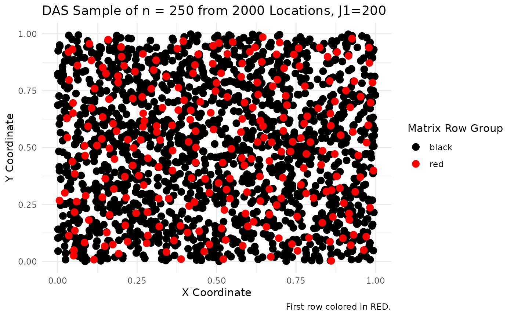
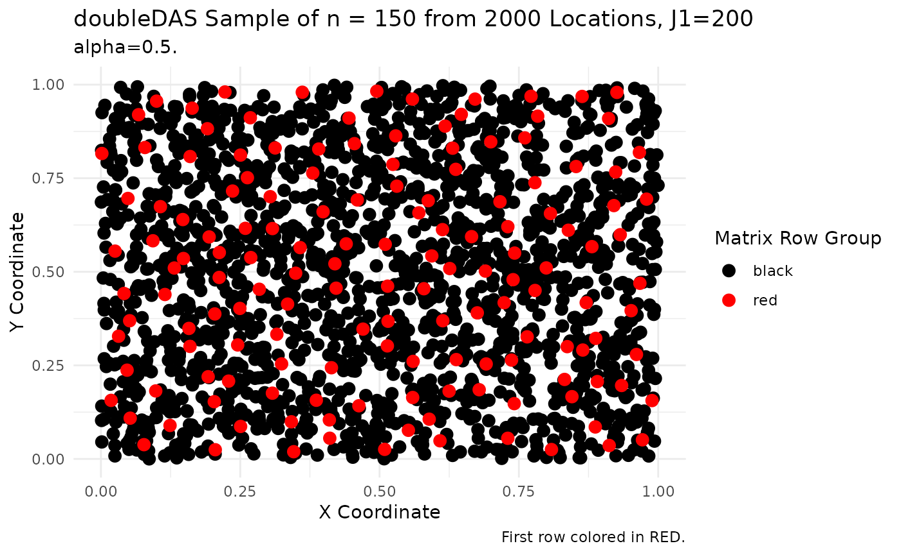

# DAS and doubleDAS User Guide

## DAS

### DAS Parameters

The following DAS parameters define the population, the number of sample
points to draw from the population and the maximum number of candidate
samples.

``` r

set.seed(2026)

# Numeric matrix of population coordinates, one unit per row.
# x points uniformly in [0,1)^2
myPop <- matrix(runif(2000 * 2), ncol = 2)

# The number of sample points to draw from the population.
n <- 250

# Maximum number of candidate samples, \code{2 <= J1 <= floor(N/2)}.
# Default is \code{min(200, floor(N/2))}. Values above 500 are allowed but
# trigger a warning (large assignment problems dominate run time).
J1 <- 200
```

#### Additional DAS Parameters

The following are additional parameters supported by DAS.

- n_threads
  - Threads used when filling the cost matrix. A value of $`0`$ uses
    every logical CPU. Parallel fill runs only when the current $`J`$ is
    at least $`256`$ and $`n\_threads`$ is greater than $`1`$. Default
    is $`1`$.
- verbose
  - Print step timings. Default is FALSE.
- cache_W
  - If $`TRUE`$, build one $`N \times N`$ inverse-distance matrix in
    C++. If $`FALSE`$, compute inverse distances on the fly. Default is
    $`TRUE`$ when $`N <= 8000`$, otherwise $`FALSE`$.

``` r

# Use all logical CPU's
n_threads <- 0

# Display step timings
verbose <- TRUE

# Build single inverse-distance matrix
cache_W <- TRUE
```

### Generate Sample

Call DAS to generate the sample.

``` r

library(spbalDAS)

sampleMatrix <- DAS(pop = myPop,
                    n = n, 
                    J1 = J1, 
                    n_threads = n_threads, 
                    verbose = verbose,
                    cache_W = cache_W)
```

    ## [2026-09-05 04:33:22.043] Starting DAS N=2000 n=250 J1=200 cache_W=TRUE n_threads=0

    ## Build inverse-distance weights: 33672 µs
    ## Step i=2 J=200 fill=0ms lapjv=16ms
    ## Step i=3 J=200 fill=0ms lapjv=17ms
    ## Step i=4 J=200 fill=0ms lapjv=15ms
    ## Step i=5 J=200 fill=0ms lapjv=16ms
    ## Step i=6 J=200 fill=0ms lapjv=16ms
    ## Step i=7 J=200 fill=0ms lapjv=12ms
    ## Step i=8 J=200 fill=0ms lapjv=12ms
    ## Step i=9 J=200 fill=0ms lapjv=12ms
    ## Step i=10 J=200 fill=0ms lapjv=11ms
    ## Step i=11 J=181 fill=0ms lapjv=9ms
    ## Step i=12 J=166 fill=0ms lapjv=7ms
    ## Step i=13 J=153 fill=0ms lapjv=6ms
    ## Step i=14 J=142 fill=0ms lapjv=5ms
    ## Step i=15 J=133 fill=0ms lapjv=4ms
    ## Step i=16 J=125 fill=0ms lapjv=3ms
    ## Step i=17 J=117 fill=0ms lapjv=3ms
    ## Step i=18 J=111 fill=0ms lapjv=2ms
    ## Step i=19 J=105 fill=0ms lapjv=2ms
    ## Step i=20 J=100 fill=0ms lapjv=2ms
    ## Step i=21 J=95 fill=0ms lapjv=2ms
    ## Step i=22 J=90 fill=0ms lapjv=1ms
    ## Step i=23 J=86 fill=0ms lapjv=1ms
    ## Step i=24 J=83 fill=0ms lapjv=1ms
    ## Step i=25 J=80 fill=0ms lapjv=1ms
    ## Step i=26 J=76 fill=0ms lapjv=1ms
    ## Step i=27 J=74 fill=0ms lapjv=1ms
    ## Step i=28 J=71 fill=0ms lapjv=0ms
    ## Step i=29 J=68 fill=0ms lapjv=0ms
    ## Step i=30 J=66 fill=0ms lapjv=0ms
    ## Step i=31 J=64 fill=0ms lapjv=0ms
    ## Step i=32 J=62 fill=0ms lapjv=0ms
    ## Step i=33 J=60 fill=0ms lapjv=0ms
    ## Step i=34 J=58 fill=0ms lapjv=0ms
    ## Step i=35 J=57 fill=0ms lapjv=0ms
    ## Step i=36 J=55 fill=0ms lapjv=0ms
    ## Step i=37 J=54 fill=0ms lapjv=0ms
    ## Step i=38 J=52 fill=0ms lapjv=0ms
    ## Step i=39 J=51 fill=0ms lapjv=0ms
    ## Step i=40 J=50 fill=0ms lapjv=0ms
    ## Step i=41 J=48 fill=0ms lapjv=0ms
    ## Step i=42 J=47 fill=0ms lapjv=0ms
    ## Step i=43 J=46 fill=0ms lapjv=0ms
    ## Step i=44 J=45 fill=0ms lapjv=0ms
    ## Step i=45 J=44 fill=0ms lapjv=0ms
    ## Step i=46 J=43 fill=0ms lapjv=0ms
    ## Step i=47 J=42 fill=0ms lapjv=0ms
    ## Step i=48 J=41 fill=0ms lapjv=0ms
    ## Step i=49 J=40 fill=0ms lapjv=0ms
    ## Step i=50 J=40 fill=0ms lapjv=0ms
    ## Step i=51 J=39 fill=0ms lapjv=0ms
    ## Step i=52 J=38 fill=0ms lapjv=0ms
    ## Step i=53 J=37 fill=0ms lapjv=0ms
    ## Step i=54 J=37 fill=0ms lapjv=0ms
    ## Step i=55 J=36 fill=0ms lapjv=0ms
    ## Step i=56 J=35 fill=0ms lapjv=0ms
    ## Step i=57 J=35 fill=0ms lapjv=0ms
    ## Step i=58 J=34 fill=0ms lapjv=0ms
    ## Step i=59 J=33 fill=0ms lapjv=0ms
    ## Step i=60 J=33 fill=0ms lapjv=0ms
    ## Step i=61 J=32 fill=0ms lapjv=0ms
    ## Step i=62 J=32 fill=0ms lapjv=0ms
    ## Step i=75 J=26 fill=0ms lapjv=0ms
    ## Step i=100 J=20 fill=0ms lapjv=0ms
    ## Step i=125 J=16 fill=0ms lapjv=0ms
    ## Step i=150 J=13 fill=0ms lapjv=0ms
    ## Step i=175 J=11 fill=0ms lapjv=0ms
    ## Step i=200 J=10 fill=0ms lapjv=0ms
    ## Step i=225 J=8 fill=0ms lapjv=0ms
    ## Step i=250 J=8 fill=0ms lapjv=0ms
    ## DAS completed in 302 ms (n_threads=4)

    ## [2026-09-05 04:33:22.347] Finished DAS.

Show first candidate sample.

``` r

# first candidate sample
s <- sampleMatrix[1,]
s
```

    ##   [1] 1615 1610 1888 1246 1520 1552  800  696   26 1021   39 1627  903  152 1250
    ##  [16]  746 1167 1216  843 1790 1505  822 1099 1395 1819 1935  533 1982  393 1686
    ##  [31] 1221 1698  555  598 1574  111 1987 1467  424 1258 1525  775 1380  118 1682
    ##  [46] 1414   11 1465  876 1177  218  640  259 1573   38 1348 1705  430  659 1313
    ##  [61]  786  480 1656 1105 1569  964 1345  272  709 1676 1082  852  702 1482 1237
    ##  [76]  469 1723  987 1942  727  414  989  222 1754  516  182  132  833 1492 1466
    ##  [91] 1602 1142  300    1  765 1929  269  308  373  403  161 1873 1316 1032 1472
    ## [106]  577  286  124  879 1968  847 1516  364   49 1036 1629  677  234 1624   71
    ## [121] 1989 1239  231   51 1215 1220  404 1774  557  133 1005 1304   10 1543  569
    ## [136]  464  332  457  431  357 1626   90  890 1180  310 1340 1452 1287 1396 1599
    ## [151] 1593 1518  368 1857 1977   48 1018 1262  264  790  744  517 1496  454 1041
    ## [166] 1867 1256  811  668 1384  550  889  412 1507 1546  915 1387   78 1084 1539
    ## [181]  610  760 1947 1168 1856  940 1186  816  832  246  377 1038 1616 1222 1932
    ## [196] 1441  465 1571 1333   50 1852 1949 1009 1716  753 1807 1559  576  195  738
    ## [211] 1164  771  224  806  229  729  656  452  823  680  717 1055  913 1967  951
    ## [226]  592 1915  472 1855  372  745 1125 1156  602 1894  883 1620   60  868  635
    ## [241]  235 1984 1071 1261 1416 1554 1138  606 1714 1146

Plot the sample.

``` r

library(reshape2)
library(ggplot2)

# plotting...
index_matrix <- sampleMatrix # leave sampleMatrix intact
df <- myPop

# Melt the matrix into long format to map indices to colors
index_long <- melt(index_matrix)
colnames(index_long) <- c("row", "col", "index")

# Merge the matrix data with the dataframe coordinates
plot_data <- merge(index_long, df, by.x = "index", by.y = "row.names")

# Create a color column for the row groups of the matrix
plot_data$color_group <- ifelse(plot_data$row == 1, "red", "black")

# Dynamic title using the actual values of n and number of locations
n_value <- n
n_locations <- length(myPop) / 2

# Plot the points - BLACK drawn first, RED on top (guaranteed layering)
ggplot(plot_data, aes(x = V1, y = V2, color = color_group)) +
  # Black points (bottom layer)
  geom_point(data = plot_data[plot_data$color_group == "black", ],
             size = 3) +
  # Red points (top layer - drawn after black)
  geom_point(data = plot_data[plot_data$color_group == "red", ],
             size = 3) +
  scale_color_manual(values = c("black" = "black", "red" = "red")) +
  theme_minimal() +
  labs(color = "Matrix Row Group",
       title = paste0("DAS Sample of n = ", n_value,
                      " from ", n_locations, " Locations, J1=", J1),
       caption = "First row colored in RED.") +
  xlab("X Coordinate") +
  ylab("Y Coordinate")
```



## doubleDAS

### doubleDAS Parameters

The following doubleDAS parameters define the population, the auxiliary
varaibles, the number of sample points to draw from the population, the
mixing parameter and the maximum number of candidate samples.

``` r

set.seed(2026)

# Numeric matrix of population coordinates, one unit per row.
# x points uniformly in [0,1)^2
myPop <- matrix(runif(2000 * 2), ncol = 2)

# Numeric matrix of auxiliary variables, one row per unit.
myAux <- matrix(runif(2000 * 2), ncol = 2)
myAux <- myAux / sqrt(rowSums(myAux^2)) 

# The number of sample points to draw from the population.
n <- 150

# Mix in [0, 1]. Default 0.5.
alpha <- 0.5

# Maximum number of candidate samples, \code{2 <= J1 <= floor(N/2)}.
# Default is \code{min(200, floor(N/2))}. Values above 500 are allowed but
# trigger a warning (large assignment problems dominate run time).
J1 <- 200
```

#### Additional doubleDAS Parameters

The following are additional parameters supported by DAS.

- n_threads
  - Threads used when filling the cost matrix. A value of $`0`$ uses
    every logical CPU. Parallel fill runs only when the current $`J`$ is
    at least $`256`$ and $`n\_threads`$ is greater than $`1`$. Default
    is $`1`$.
- verbose
  - Print step timings. Default is FALSE.
- cache_W
  - If $`TRUE`$, build one $`N \times N`$ inverse-distance matrix in C++
    when $`alpha > 0`$. If $`FALSE`$, compute inverse distances on the
    fly. Default is $`TRUE`$ when $`N <= 2500`$, otherwise $`FALSE`$. At
    large $`N`$ this is usually slower than on-the-fly distances.

``` r

# Use all logical CPU's
n_threads <- 0

# Display step timings
verbose <- TRUE

# Build single inverse-distance matrix
cache_W <- TRUE
```

### Generate Sample

Call doubleDAS to generate the sample.

``` r

library(spbalDAS)

sampleMatrix <- doubleDAS(pop = myPop,
                          aux = myAux,
                          n = n,
                          alpha = alpha,
                          J1 = J1, 
                          n_threads = n_threads, 
                          verbose = verbose,
                          cache_W = cache_W)
```

    ## [2026-09-05 04:33:23.570] Starting doubleDAS N=2000 n=150 J1=200 alpha=0.500 cache_W=TRUE

    ## Build inverse-distance weights: 34517 µs
    ## Step i=2 J=200 fill=0ms lapjv=13ms
    ## Step i=3 J=200 fill=0ms lapjv=17ms
    ## Step i=4 J=200 fill=0ms lapjv=14ms
    ## Step i=5 J=200 fill=0ms lapjv=16ms
    ## Step i=6 J=200 fill=0ms lapjv=14ms
    ## Step i=7 J=200 fill=0ms lapjv=16ms
    ## Step i=8 J=200 fill=0ms lapjv=13ms
    ## Step i=9 J=200 fill=1ms lapjv=12ms
    ## Step i=10 J=200 fill=1ms lapjv=13ms
    ## Step i=11 J=181 fill=1ms lapjv=9ms
    ## Step i=12 J=166 fill=0ms lapjv=7ms
    ## Step i=13 J=153 fill=0ms lapjv=6ms
    ## Step i=14 J=142 fill=0ms lapjv=4ms
    ## Step i=15 J=133 fill=0ms lapjv=4ms
    ## Step i=16 J=125 fill=0ms lapjv=3ms
    ## Step i=17 J=117 fill=0ms lapjv=3ms
    ## Step i=18 J=111 fill=0ms lapjv=2ms
    ## Step i=19 J=105 fill=0ms lapjv=2ms
    ## Step i=20 J=100 fill=0ms lapjv=2ms
    ## Step i=21 J=95 fill=0ms lapjv=2ms
    ## Step i=22 J=90 fill=0ms lapjv=1ms
    ## Step i=23 J=86 fill=0ms lapjv=1ms
    ## Step i=24 J=83 fill=0ms lapjv=1ms
    ## Step i=25 J=80 fill=0ms lapjv=1ms
    ## Step i=26 J=76 fill=0ms lapjv=1ms
    ## Step i=27 J=74 fill=0ms lapjv=1ms
    ## Step i=28 J=71 fill=0ms lapjv=0ms
    ## Step i=29 J=68 fill=0ms lapjv=0ms
    ## Step i=30 J=66 fill=0ms lapjv=0ms
    ## Step i=31 J=64 fill=0ms lapjv=0ms
    ## Step i=32 J=62 fill=0ms lapjv=0ms
    ## Step i=33 J=60 fill=0ms lapjv=0ms
    ## Step i=34 J=58 fill=0ms lapjv=0ms
    ## Step i=35 J=57 fill=0ms lapjv=0ms
    ## Step i=36 J=55 fill=0ms lapjv=0ms
    ## Step i=37 J=54 fill=0ms lapjv=0ms
    ## Step i=38 J=52 fill=0ms lapjv=0ms
    ## Step i=39 J=51 fill=0ms lapjv=0ms
    ## Step i=40 J=50 fill=0ms lapjv=0ms
    ## Step i=41 J=48 fill=0ms lapjv=0ms
    ## Step i=42 J=47 fill=0ms lapjv=0ms
    ## Step i=43 J=46 fill=0ms lapjv=0ms
    ## Step i=44 J=45 fill=0ms lapjv=0ms
    ## Step i=45 J=44 fill=0ms lapjv=0ms
    ## Step i=46 J=43 fill=0ms lapjv=0ms
    ## Step i=47 J=42 fill=0ms lapjv=0ms
    ## Step i=48 J=41 fill=0ms lapjv=0ms
    ## Step i=49 J=40 fill=0ms lapjv=0ms
    ## Step i=50 J=40 fill=0ms lapjv=0ms
    ## Step i=51 J=39 fill=0ms lapjv=0ms
    ## Step i=52 J=38 fill=0ms lapjv=0ms
    ## Step i=53 J=37 fill=0ms lapjv=0ms
    ## Step i=54 J=37 fill=0ms lapjv=0ms
    ## Step i=55 J=36 fill=0ms lapjv=0ms
    ## Step i=56 J=35 fill=0ms lapjv=0ms
    ## Step i=57 J=35 fill=0ms lapjv=0ms
    ## Step i=58 J=34 fill=0ms lapjv=0ms
    ## Step i=59 J=33 fill=0ms lapjv=0ms
    ## Step i=60 J=33 fill=0ms lapjv=0ms
    ## Step i=61 J=32 fill=0ms lapjv=0ms
    ## Step i=62 J=32 fill=0ms lapjv=0ms
    ## Step i=75 J=26 fill=0ms lapjv=0ms
    ## Step i=100 J=20 fill=0ms lapjv=0ms
    ## Step i=125 J=16 fill=0ms lapjv=0ms
    ## Step i=150 J=13 fill=0ms lapjv=0ms
    ## doubleDAS completed in 311 ms (n_threads=4)

    ## [2026-09-05 04:33:23.882] Finished doubleDAS.

Show first candidate sample.

``` r

# first candidate sample
s <- sampleMatrix[1,]
s
```

    ##   [1]  725   99  822 1046 1265  705  920 1872  910  650  639  325  129  921  547
    ##  [16]  518 1553 1956  512  232 1201  159 1058  772 1271  589  752 1733 1276 1983
    ##  [31] 1768 1300 1317 1612 1034  237 1683 1096  847  145  386  339 1228  687 1775
    ##  [46]  526  983 1894  573 1432 1492  407  843 1867 1513 1008  565 1773  958  604
    ##  [61] 1832 1322 1113 1849 1945 1273  120  266 1633 1929  599 1005 1691 1106 1405
    ##  [76]  586 1275 1455  384  305  297  523  241 1572  152 1606 1054 1439 1785 1263
    ##  [91] 1067 1482  942 1514  276 1232  205 1331 1217 1195  894 1778  163  511 1555
    ## [106] 1209 1277  820  615  851 1422 1353 1798 1797  348  863 1796 1855  776 1870
    ## [121]  879   44 1039 1587   27  371  993 1875 1146  373 1812 1283  727  366   73
    ## [136] 1360 1436  187 1770  397  469  862  389 1234 1425 1426 1786  293 1242 1996

Plot the sample.

``` r

library(reshape2)
library(ggplot2)

# plotting...
index_matrix <- sampleMatrix # leave sampleMatrix intact
df <- myPop

# Melt the matrix into long format to map indices to colors
index_long <- melt(index_matrix)
colnames(index_long) <- c("row", "col", "index")

# Merge the matrix data with the dataframe coordinates
plot_data <- merge(index_long, df, by.x = "index", by.y = "row.names")

# Create a color column for the row groups of the matrix
plot_data$color_group <- ifelse(plot_data$row == 1, "red", "black")

# Dynamic title using the actual values of n and number of locations
n_value <- n
n_locations <- length(myPop) / 2

# Plot the points, colored by the row group of the matrix
ggplot(plot_data, aes(x = V1, y = V2, color = color_group)) +
  # Black points (bottom layer)
  geom_point(data = plot_data[plot_data$color_group == "black", ],
             size = 3) +
  # Red points (top layer - drawn after black)
  geom_point(data = plot_data[plot_data$color_group == "red", ],
             size = 3) +
  scale_color_manual(values = c("black" = "black", "red" = "red")) +
  theme_minimal() +
  labs(color = "Matrix Row Group",
       title = paste0("doubleDAS Sample of n = ", n_value,
                      " from ", n_locations, " Locations, J1=", J1),
       subtitle = paste0("alpha=", alpha, "."),
       caption = "First row colored in RED.") +
  xlab("X Coordinate") +
  ylab("Y Coordinate")
```



### The End
